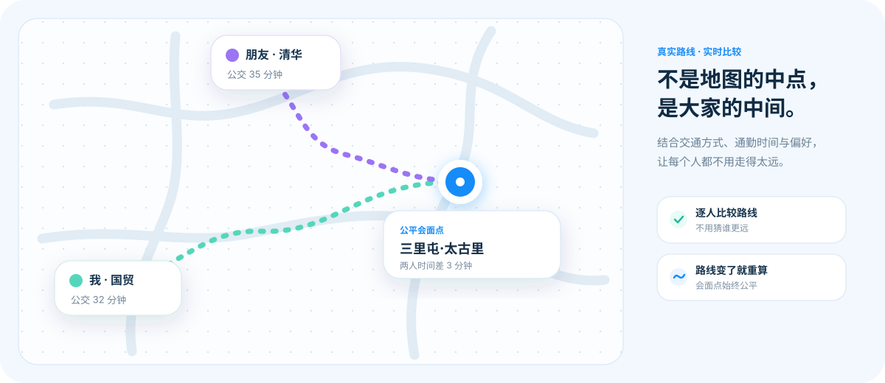
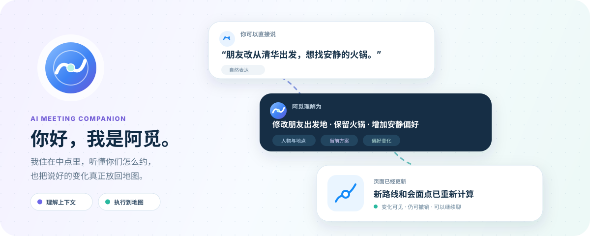
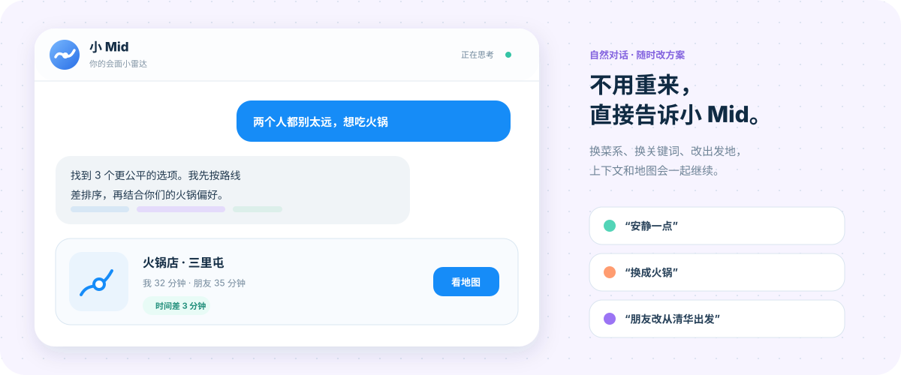
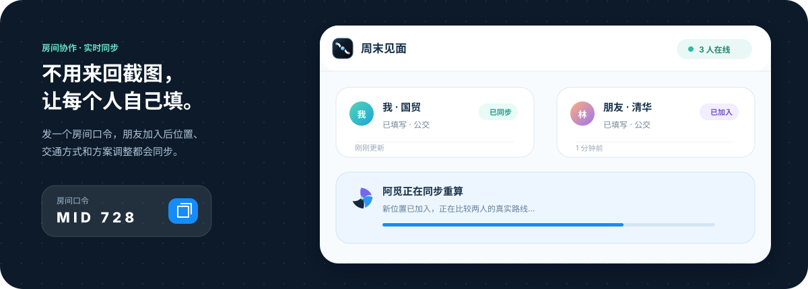

<p align="center">
  
</p>

<p align="center">
  <a href="https://middot.myowl.me/"><strong>立即体验</strong></a>
  &nbsp;·&nbsp;
  <a href="#认识阿觅">认识阿觅</a>
  &nbsp;·&nbsp;
  <a href="#会面档案让下一次不从零开始">会面档案</a>
  &nbsp;·&nbsp;
  <a href="#本地运行">本地运行</a>
</p>

<p align="center">
  
  
  
</p>

## 为什么需要中点

约人见面，难的通常不是“附近有什么”，而是**哪里对每个人都合适**。

一个人在国贸，一个人在清华；有人坐地铁，有人骑车；这次想安静聊天，下次又想吃火锅。地图能给出几何中心，却不会替大家权衡真实路程和见面偏好。

**中点 Middot** 就是为这件事而生：把每个人从哪里出发、怎么出行、想做什么放到同一个方案里，找到一个不只在地图中央，也让大家更愿意赴约的地方。

<p align="center">
  
</p>

## 公平，不只是地图上的正中央

两点之间的直线中点看起来最公平，真实世界却不是直线：地铁要换乘，河流和高架会绕路，不同交通方式也会改变答案。

Middot 会分别计算每个人的实际路线，把时间差和整体成本一起考虑，再到这个公平区域里寻找真正适合见面的店和场所。你仍然可以移动锚点、调整范围，或者为每个人单独选择公交、驾车、骑行和步行。

<p align="center">
  
</p>

但位置只是会面的一部分。计划还会变化：朋友临时换了出发地、有人加入、大家忽然想换一种店。为了让这些变化不必一次次重填表单，Middot 里住着一位真正理解当前方案的 AI 会面伙伴。

## 认识阿觅

**阿觅** 是中点 Middot 的 AI 会面伙伴。她站在两个人表达的交叠处，听懂各自的差异，再把形成的共识落回同一张地图。她的标记也来自这个过程：两片声音相遇，中央亮起一束共识微光。

你不需要学习命令，也不用先把所有条件整理得井井有条。告诉阿觅“朋友改从清华出发”“想找安静一点的火锅”或“这几家谁更公平”，她会接着当前方案继续处理，并把发生的变化留在页面上。

<p align="center">
  
</p>

## 条件变了，接着说就好

传统筛选器要求你返回上一层、改完条件再重新搜索。阿觅保留正在进行的会面上下文，所以一句“安静一点”是在调整现有结果，而不是开启一次互不相关的新搜索。

她也不只会执行：当用户问“为什么这家排第一”，阿觅会根据真实路线和当前偏好解释，而不是编造一个听起来合理的答案。

<p align="center">
  
</p>

## 一起决定，不必一个人填完

会面属于所有参与者，位置也应该由每个人自己确认。

建立房间后，把口令发给朋友即可加入。每个人可以填写自己的出发地和交通方式；成员的操作会同步给房间，阿觅带来的方案变化也会说明由谁触发。大家看到的是同一张地图、同一组结果和同一条决策过程。

<p align="center">
  
</p>

## 会面档案：让下一次不从零开始

一次计划结束后，有些信息值得在下一次继续使用——常约的人通常从哪里出发、你平时更喜欢哪种交通方式、哪些偏好是长期的。

阿觅会把有明确来源的长期信息整理进**会面档案**，但不会把一次搜索、一个推荐结果或模型猜测偷偷当成事实。不确定、敏感或互相冲突的线索会留在“待确认”，不会直接影响后续规划。

后台只维护一份带来源和版本的事实库；“关于我”“常约的人”“地点与店铺”是它面向会面场景的不同视图，图谱则把同一批事实换成关系网络来展示。无论从档案还是图谱修改，后续规划读到的都会同步变化。

<p align="center">
  
</p>

这套记忆始终遵循三件事：

1. **看得见**：知道阿觅记住了什么，也能回到它来自的对话。
2. **改得动**：待确认关系可以确认或忽略，正式关系可以修改或删除。
3. **会过期**：地点和时效性信息不会被当作永远不变的事实。

从第一次输入位置，到一起调整方案，再到下一次自然接着聊，Middot 想做的不是替大家决定去哪里，而是让“约在哪儿”不再成为见面前最费劲的那一步。

## 本地运行

```bash
git clone https://github.com/Kiong2002/Middot.git
cd Middot
cp .env.example .env
bash start.sh
```

按 `.env.example` 填写地图与模型配置，然后打开 <http://localhost:5000>。

需要 Python 3.10 或更高版本。项目不依赖前端构建工具，克隆后即可运行。

## 现在正在做

- [x] 多人出发地与公平路线比较
- [x] 阿觅自然语言调整方案
- [x] 房间协作与共享会面状态
- [x] 历史对话与后台记忆整理
- [x] 可追溯、可确认的会面档案
- [x] 可搜索、可移动的记忆图谱
- [ ] 更自然的多人协作提醒
- [ ] 更丰富的会面复盘与收藏体验

## License

MIT
